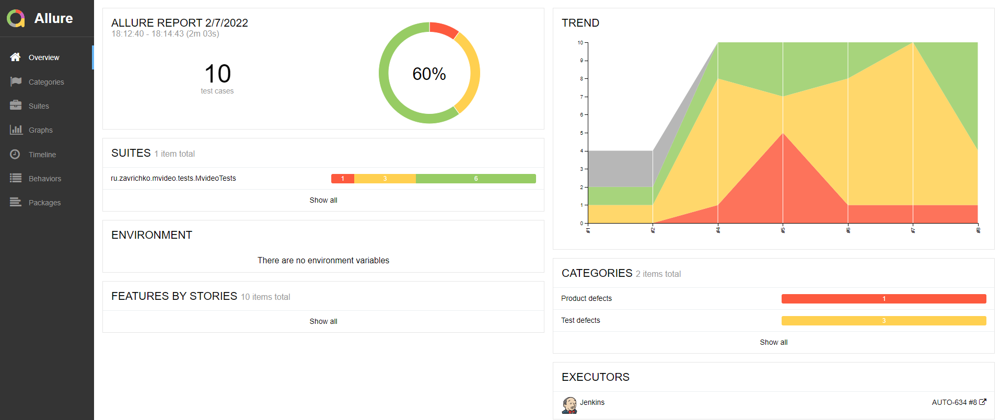
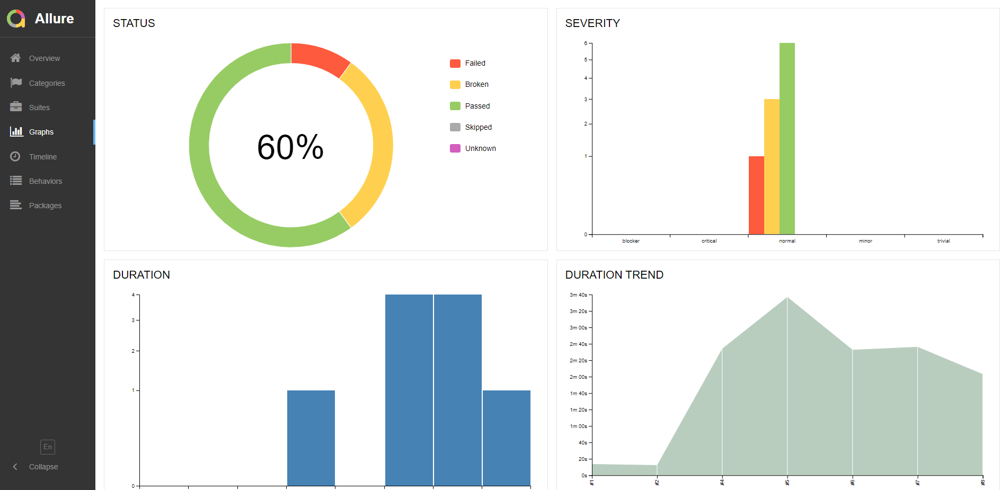
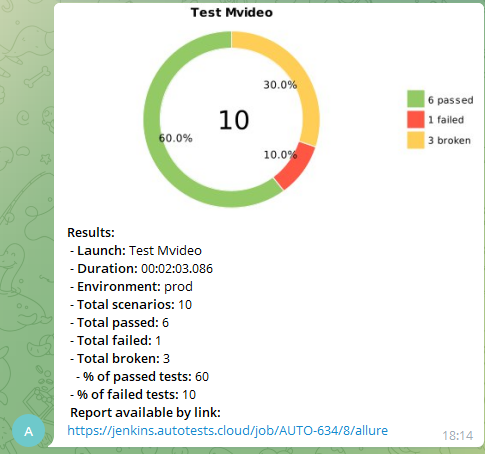

## :cherry_blossom:	Содержание

> ➠ [Покрытый функционал](#earth_africa-покрытый-функционал)
>
> ➠ [Технологический стек](#classical_building-технологический-стек)
>
> ➠ [Запуск тестов из терминала](#-запуск-тестов-из-терминала)
>
> ➠ [Запуск тестов в Jenkins](#-запуск-тестов-в-jenkins)
>
> ➠ [Отчет о результатах тестирования в Allure Report](#-отчет-о-результатах-тестирования-в-allure-report)
>
> ➠ [Уведомления в Telegram с использованием бота](#-уведомления-в-telegram-с-использованием-бота)
>
> ➠ [Пример запуска теста в Selenoid](#-пример-запуска-теста-в-selenoid)


## :earth_africa: Покрытый функционал

> Разработаны автотесты на <code>UI</code>.
### UI

- [x] Проверка отображения страницы поиска товаров
- [x] Отсутствие ошибок в журнале консоли страницы
- [x] Проверка количества найденного товара
- [x] Проверка списка брендов
- [x] Проверка фильтра товаров
- [x] Проверка ошибки "По Вашему запросу ничего не найдено"
- [x] Проверка ошибки "Извините, не удалось обработать ваш запрос."
- [x] Проверка отображения картинки при неправильном запросе
- [x] Проверка поиска большого значения
- [x] Проверка смешанного типа запроса

## :classical_building: Технологический стек

<p align="center">


</p>

 В данном проекте автотесты написаны на <code>Java</code> с использованием <code>Selenide</code> для UI-тестов.
>
> <code>Selenoid</code> выполняет запуск браузеров в контейнерах <code>Docker</code>.
>
> <code>Allure Report</code> формирует отчет о запуске тестов.
>
> Для автоматизированной сборки проекта используется <code>Gradle</code>.
>
> В качестве библиотеки для модульного тестирования используется <code>JUnit 5</code>.
>
> <code>Jenkins</code> выполняет запуск тестов.
> После завершения прогона отправляются уведомления с помощью бота в <code>Telegram</code>.


## Запуск тестов из терминала

### :robot: Локальный запуск тестов

```
gradle clean test
```

### :robot: Удаленный запуск тестов 

```
clean
test
-Dbrowser=${BROWSER}
-DbrowserVersion=${BROWSER_VERSION}
-DbrowserSize=${BROWSER_SIZE}
-DbrowserMobileView="${BROWSER_MOBILE}"
-DremoteDriverUrl=https://user1:1234@${REMOTE_DRIVER_URL}/wd/hub/
-DvideoStorage=https://${REMOTE_DRIVER_URL}/video/
-Dthreads=${THREADS}
```

### :robot: Параметры сборки

> <code>REMOTE_URL</code> – адрес удаленного сервера, на котором будут запускаться тесты.
>
> <code>BROWSER</code> – браузер, в котором будут выполняться тесты (_по умолчанию - <code>chrome</code>_).
>
> <code>BROWSER_VERSION</code> – версия браузера, в которой будут выполняться тесты (_по умолчанию - <code>91.0</code>_).
>
> <code>BROWSER_SIZE</code> – размер окна браузера, в котором будут выполняться тесты (_по умолчанию - <code>1920x1080</code>_).


### :skier: Главная страница Allure-отчета

<p align="center">

</p>

### :eye_speech_bubble: Группировка тестов по проверяемому функционалу

<p align="center">

</p>


### :frog: Основной дашборд

<p align="center">

</p>


##  Уведомления в Telegram с использованием бота

> После завершения сборки специальный бот, созданный в <code>Telegram</code>, автоматически обрабатывает и отправляет сообщение с отчетом о прогоне.

<p align="center">

</p>

##  Пример запуска теста в Selenoid

> К каждому тесту в отчете прилагается видео. Одно из таких видео представлено ниже.
<p align="center">
  
</p>


